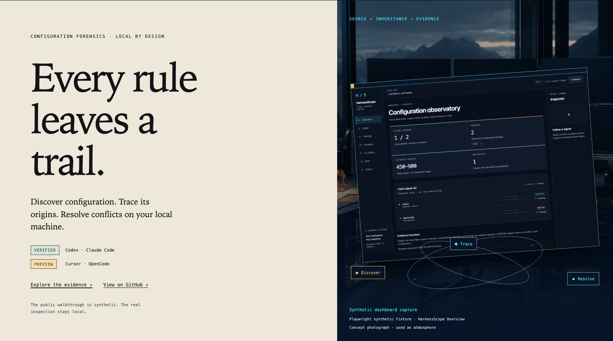
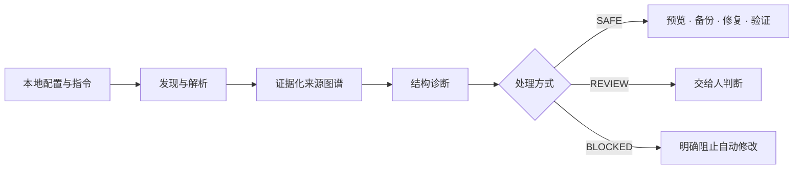
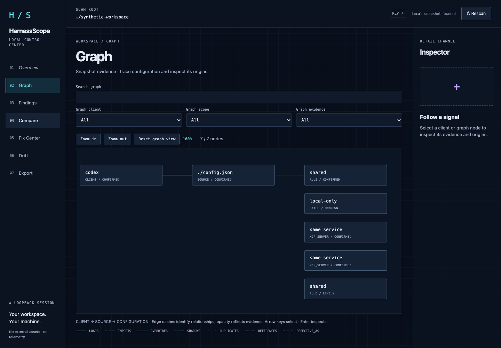
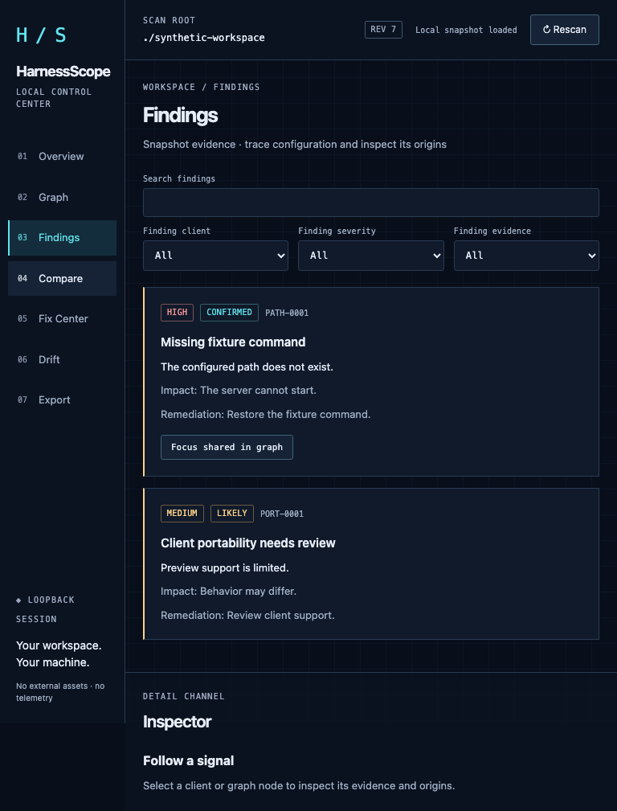
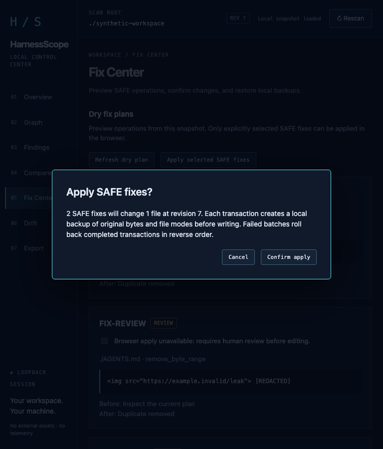
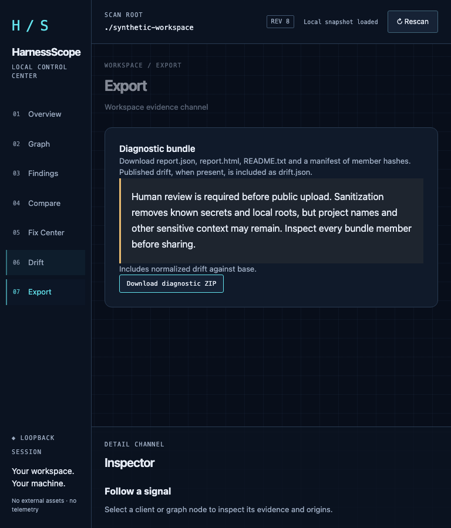
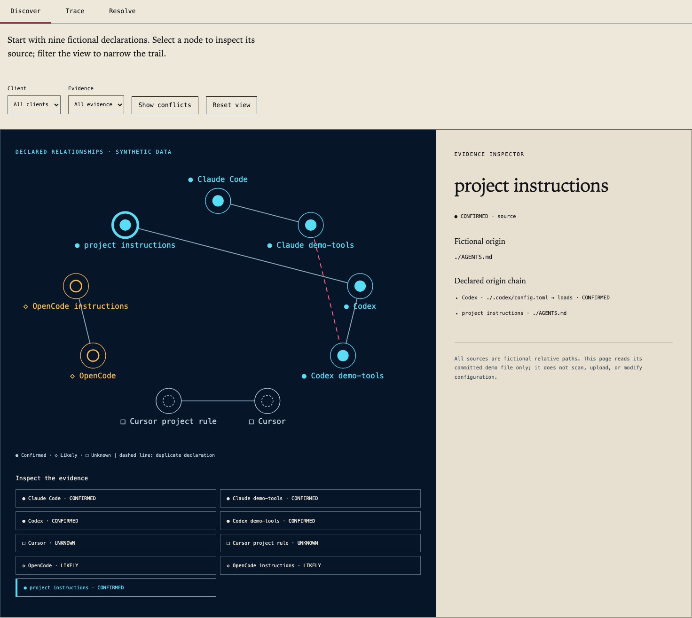
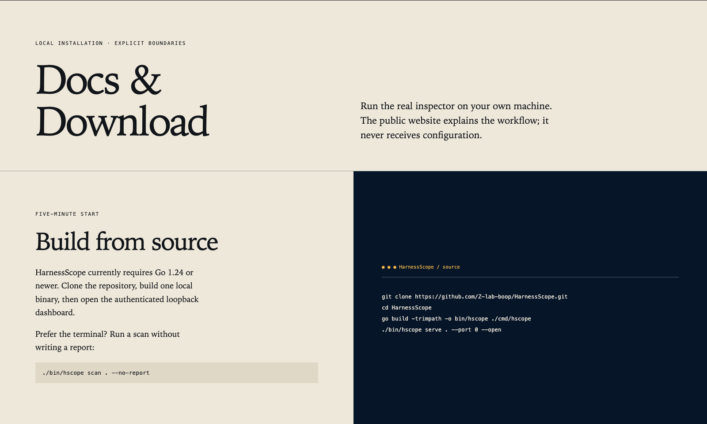

# HarnessScope

Local configuration forensics for coding agents.

[Website](https://z-lab-boop.github.io/HarnessScope/) · [Explore](https://z-lab-boop.github.io/HarnessScope/explore.html) · [Docs](https://z-lab-boop.github.io/HarnessScope/docs.html) · [Releases](https://github.com/Z-lab-boop/HarnessScope/releases) · [中文](README.zh-CN.md) · [English overview](#english-overview)

| Discover | Trace | Resolve |
| --- | --- | --- |
| Find configuration sources | Follow provenance and precedence evidence | Review conflicts and SAFE fixes |

Codex and Claude Code have version-specific VERIFIED adapters; Cursor and OpenCode remain PREVIEW. Inspection stays local and offline, with no telemetry. Build from source; Releases is an informational link while the formal release gate remains open.

The hero combines a Playwright synthetic dashboard capture with decorative generated concept photography. It contains no real user configuration. The technical guide below is in Chinese; see the [English overview](#english-overview) or [English website documentation](https://z-lab-boop.github.io/HarnessScope/docs.html).

> **不是又一个“帮你改配置”的黑盒。** HarnessScope 更像一台配置 X 光机：先发现、再解释、最后只对明确安全的操作提供可回滚修复。

## 🧭 你的配置，可能比想象中更复杂

一个编码助手可能同时读取用户级、项目级和嵌套目录中的 Rules、MCP、Hook、Skill 与指令文件。名字相同不代表行为相同，文件存在也不代表命令能启动。

HarnessScope 聚焦三个问题：

| 你真正想知道的 | HarnessScope 给出的答案 |
|---|---|
| **到底加载了什么？** | 枚举已发现的配置与指令来源，并标注客户端、作用域和证据等级。 |
| **这一条从哪里来的？** | 用来源图谱解释 Rule、MCP、Hook、Skill 的加载与覆盖关系。 |
| **现在应该处理什么？** | 定位冲突、失效路径、重复上下文、裸命令和潜在凭据暴露。 |



## ⚡ 一分钟启动

当前公开仓库尚未发布正式二进制 Release，请从源码构建：

```sh
git clone https://github.com/Z-lab-boop/HarnessScope.git
cd HarnessScope
go build -trimpath -o bin/hscope ./cmd/hscope
./bin/hscope serve . --port 0 --open
```

浏览器会打开一次性认证地址。服务只监听 `127.0.0.1`，没有云端服务、遥测或后台实时监控。只想看终端结果：

```sh
./bin/hscope scan . --no-report
```

## 🖥️ 真实界面

下列画面均由仓库内置的 Playwright 合成夹具生成，不包含真实用户配置。

<table>
  <tr>
    <td width="50%"><br><strong>01 · Overview</strong><br>客户端证据、风险和上下文成本一屏掌握。</td>
    <td width="50%"><br><strong>02 · Graph</strong><br>沿着来源、加载、覆盖和引用关系追踪配置。</td>
  </tr>
  <tr>
    <td width="50%"><br><strong>03 · Findings</strong><br>按客户端、严重度和证据等级筛选问题。</td>
    <td width="50%"><br><strong>04 · Fix Center</strong><br>核对精确变更后，才允许应用 SAFE 修复。</td>
  </tr>
</table>

<details>
<summary><strong>再看一张：脱敏诊断包导出</strong></summary>



导出包包含报告、离线 HTML、清单和可选漂移结果；不包含原始配置、备份、会话令牌或明文凭据。
</details>

### 🌐 在线体验

公开网站只使用虚构合成数据，不扫描、不上传、也不修改访问者的配置。

下列图片是公开网站的英文截图：Explore 展示仓库内置的虚构数据，Docs 展示源码构建说明；它们不是本地仪表盘的扫描结果。

<table>
  <tr>
    <td width="50%"><a href="https://z-lab-boop.github.io/HarnessScope/explore.html"></a><br><strong>Explore</strong><br>在浏览器中选择节点、筛选证据并预览虚构安全修复。</td>
    <td width="50%"><a href="https://z-lab-boop.github.io/HarnessScope/docs.html"></a><br><strong>Docs &amp; Download</strong><br>查看构建方式、兼容性证据和本地离线边界。</td>
  </tr>
</table>

## 🔬 它能发现什么

| 能力 | 例子 | 输出方式 |
|---|---|---|
| 🧬 **来源追踪** | 同名 MCP 在多个客户端或作用域重复声明 | 图谱、来源链、证据等级 |
| ⚡ **启动风险** | 命令不存在、绝对路径失效、Hook 无执行权限 | 可操作 Finding |
| 🧩 **配置分歧** | 相同名称对应不同的安全化声明 | 多客户端 Compare |
| 🧠 **上下文体检** | 指令内容重复加载、导入关系异常 | 保守 token 区间与关系边 |
| 🔐 **凭据预警** | 项目配置出现 credential-shaped 字段 | 立即脱敏，只报告类别 |
| 🧯 **安全修复** | 字节级重复行、执行位、同对象规范路径 | dry-run、备份、原子写入、自动回滚 |
| 🕰️ **漂移追踪** | 配置身份、诊断或安全语义发生变化 | 本地脱敏基线，不展示原始值 |
| 📦 **诊断导出** | 需要分享一个最小化问题包 | 确定性 ZIP 与 SHA-256 清单 |

## 🧱 支持边界

| 客户端 | 等级 | v0.2 边界 |
|---|---|---|
| **Codex** | `VERIFIED` | 精确验证 `0.162.0-alpha.2`；其他版本显示兼容性未知。 |
| **Claude Code** | `VERIFIED` | 精确验证 `2.1.259`；其他版本显示兼容性未知。 |
| **Cursor** | `PREVIEW` | 检查文档化的本地 Rules 与 MCP 来源，不声称确定的覆盖优先级。 |
| **OpenCode** | `PREVIEW` | 检查本地 JSON/JSONC 与指令来源，不拉取远程配置。 |

`VERIFIED` 表示适配规则在指定版本上有证据，并不表示你的配置一定安全；`PREVIEW` 表示只做保守发现，不把未知行为包装成事实。

## 🛡️ 默认把安全边界画清楚

- **Local-first**：扫描、报告、快照、备份和回滚都留在本机。
- **Privacy-first**：秘密字段在解析后立即脱敏，扫描根目录折叠为 `.`，用户目录折叠为 `~`。
- **Dry-run-first**：`fix` 默认只预览；只有显式 `--apply` 才会修改。
- **Fail-closed**：执行前校验预览授权、revision 与源文件哈希；失败时拒绝或自动回滚。
- **Evidence-bounded**：不启动 MCP 服务，不猜测未公开的客户端内部逻辑。

秘密检测无法覆盖所有专有格式。公开分享报告或 ZIP 前，仍应进行一次人工检查。

## 🧰 常用命令

<details>
<summary>展开 CLI 速查表</summary>

```text
hscope scan [path] [--client all|codex|claude|cursor|opencode]
hscope explain <规范化名称> [--client ...] [--path ...]
hscope compare <客户端A> <客户端B> [--path ...]
hscope report --from report.json --html report.html
hscope fix [修复ID...]              # 默认仅预览
hscope fix [修复ID...] --apply      # 只应用 SAFE 修复
hscope rollback <备份ID>
hscope serve [path] [--port 0] [--open] [--client ...]
hscope snapshot save <名称> [path]
hscope snapshot list
hscope snapshot diff <名称> [path]
hscope export [path] --output diagnostic.zip [--baseline <名称>] [--force]
hscope --version
```
</details>

## 🎮 先用虚构配置试玩

```sh
./demo/run.sh          # 非交互断言与报告
./demo/dashboard.sh    # 启动一次性浏览器演示
```

演示只操作临时目录中的合成配置，拒绝已存在的系统级托管配置。它不会修改你的真实编码助手设置。

## 🚦 当前状态

- ✅ 源码、双平台 CI、竞态测试、浏览器回归和四平台候选归档验证已公开。
- 🟡 Linux 的 Report、Overview、Graph 三套人工审核视觉基线仍为 **OPEN**。
- 🔒 正式 Release 工作流会在上述门禁关闭前拒绝发布；当前没有伪装成正式版的二进制下载。
- 🧭 后续方向：扩展版本证据、更多客户端适配、图谱视口持久化与正式签名发布。

详细边界见 [发布门禁](docs/release-gates.md)、[视觉证据](docs/visual-baselines.md)、[架构](docs/architecture.md) 与 [安全策略](SECURITY.md)。

## 🤝 一起把配置黑盒变透明

欢迎提交 Issue、补充可复核的客户端证据，或贡献新的结构诊断规则。如果 HarnessScope 对你有帮助，欢迎点一个 ⭐，让更多使用 AI 编码助手的人看到它。

<a id="english-overview"></a>
<details>
<summary><strong>English overview</strong></summary>

HarnessScope is a local, offline configuration observatory for coding agents. It discovers configuration and instruction sources, explains provenance, surfaces structural risks, previews strictly bounded SAFE fixes, tracks sanitized drift, and exports deterministic diagnostic bundles. Codex and Claude Code adapters have version-specific verified evidence; Cursor and OpenCode remain conservative previews. No cloud service, telemetry, or background monitoring is involved.

Build from source with Go 1.24 or newer. A tagged binary release is intentionally blocked until the reviewed Linux visual baseline gate is closed.
</details>

---

<div align="center">
  <sub>Apache-2.0 · Built for transparent, local-first agent configuration</sub>
</div>
