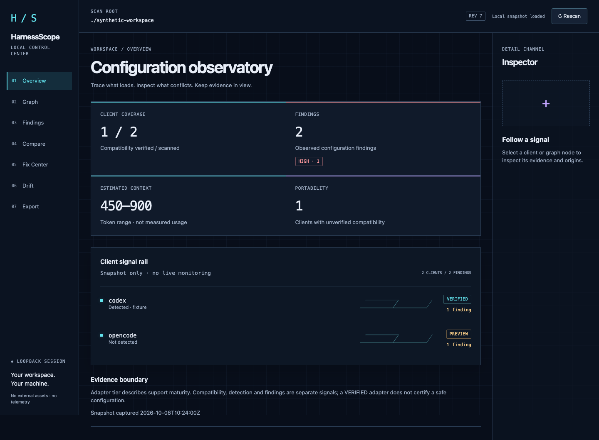

# HarnessScope

HarnessScope v0.2 是一个本地、离线的编码助手配置体检工具与浏览器仪表盘，用来回答三个问题：实际发现了哪些配置；某条规则、MCP、Hook 或 Skill 从哪里来；哪些冲突、失效路径和重复上下文值得处理。

当前版本对 Codex `0.162.0-alpha.2`、Claude Code `2.1.259` 提供 `VERIFIED` 适配器，对 Cursor、OpenCode 提供保守的 `PREVIEW` 适配器。预览适配器只读取官方文档支持的本地来源，不把未经验证的覆盖关系包装成确定事实。

## 五分钟上手

从 GitHub Releases 下载与你的系统和架构匹配的压缩包，并先用同一发布页的 `SHA256SUMS` 校验：

```sh
shasum -a 256 -c SHA256SUMS
tar -xzf harnessscope_v0.2.0_darwin_arm64.tar.gz
./hscope serve . --port 0 --open
```

Linux 可使用 `sha256sum -c SHA256SUMS`。发布包覆盖 darwin/linux × amd64/arm64，包含二进制、双语说明、安全说明、文档与许可证。生成本地候选包不代表已正式发布。在首个正式标签发布前，也可用 Go 1.24 或更高版本从源码构建：

```sh
go build -trimpath -o bin/hscope ./cmd/hscope
./bin/hscope serve . --port 0 --open
```

默认情况下，JSON 与单文件离线 HTML 报告写入系统应用数据目录，不污染被扫描的仓库。只想看终端结果时可加 `--no-report`。

## 常用命令

```text
hscope scan [path] [--client all|codex|claude|cursor|opencode]
hscope explain <规范化名称> [--client ...] [--path ...]
hscope compare <客户端A> <客户端B> [--path ...]
hscope report --from report.json --html report.html
hscope fix [修复ID...]              # 默认仅预览
hscope fix [修复ID...] --apply      # 只应用 SAFE 修复
hscope rollback <备份ID>
hscope serve [path] [--port 0] [--open] [--client ...]
hscope snapshot save <名称> [path]
hscope snapshot list
hscope snapshot diff <名称> [path]
hscope export [path] --output diagnostic.zip [--baseline <名称>] [--force]
```

仓库内置合成演示：

```sh
./demo/run.sh
```

演示复制虚构配置到临时目录，拒绝存在系统级托管配置的主机，不修改真实用户配置。它检查重复 MCP/上下文、失效路径，以及版本未验证、裸命令缺失、路径不可移植、配置分歧、项目凭据存在、符号链接越界六类新增规则，并验证快照、漂移、ZIP 与泄漏边界。Codex/Claude 显示 `VERIFIED`，Cursor/OpenCode 显示 `PREVIEW`。运行 `./demo/dashboard.sh` 可体验同一临时配置的浏览器仪表盘；Ctrl-C 会关闭服务并清理临时数据。非交互演示保留输出供查看。

## 本地仪表盘、快照和导出

`serve` 仅绑定 `127.0.0.1`，`--port 0` 自动选端口；启动时仅输出一次带认证片段的地址。浏览器把令牌保存在内存并移除地址栏片段，刷新后需要重新打开原启动地址。没有远程访问、云服务、遥测或后台实时监测；Rescan 显式更新固定工作区快照。

Overview 展示证据等级与风险；Graph 展示来源关系与检查器；Findings 筛选结构性问题；Compare 对照规范化声明。Fix Center 需选择 SAFE 方案、核对预览并确认后才应用。REVIEW/BLOCKED 不可通过浏览器应用。过期版本会刷新状态并要求重新确认；备份与回滚在本地执行。



该图来自已提交的 Playwright 合成夹具，是经目检的 macOS Chromium 示意截图，不是真实用户配置，也不是 Linux 视觉回归基线。[截图来源与待完成门禁](docs/visual-baselines.md)。

Drift 保存脱敏的本地基线并比较规范化身份与指纹，不展示原始前后值、路径或时间差，也不作语义分析。名称允许 1–64 个 ASCII 字母、数字、点、下划线或连字符，首字符须为字母或数字；同名保存会替换旧基线。文件存于平台应用数据目录，仅用户可读写。

ZIP 包含 `report.json`、离线 `report.html`、`README.txt`、`manifest.json`，选择基线后另含 `drift.json`。清单记录客户端等级、工具/Schema 版本、生成时间与成员 SHA-256；不打包原始配置、凭据、备份或会话令牌。浏览器仅下载到本地，CLI 覆盖既有文件须显式 `--force`。公开上传前仍需逐项人工检查。

## 隐私与修复安全

- 扫描在本地完成，HTML 不引用外部脚本、字体或样式，也不发起网络请求。
- 秘密字段与常见凭据模式在解析后立即脱敏。
- 报告中扫描根目录显示为 `.`，用户主目录显示为 `~`。
- `fix` 默认 dry-run；只有显式 `--apply` 才会修改。
- 自动修复仅限三类 `SAFE` 操作：同一来源中的字节级重复行、已有 shebang Hook 的执行位、指向同一文件对象的规范路径。
- 应用前校验源文件哈希；随后创建仅用户可读的备份，重扫验证；验证失败自动回滚。

秘密检测不可能覆盖所有私有格式。公开报告前仍应人工快速检查，尤其是包含内部编号或专有标识符的配置。

## 支持边界

| 客户端 | 等级 | v0.2 边界 |
|---|---|---|
| Codex | VERIFIED | 精确验证版本为 `0.162.0-alpha.2`；其他版本显示兼容性未知。 |
| Claude Code | VERIFIED | 精确验证版本为 `2.1.259`；其他版本显示兼容性未知。 |
| Cursor | PREVIEW | 检查官方文档声明的本地 Rules 与 MCP 来源，不声明确定的有效覆盖关系。 |
| OpenCode | PREVIEW | 检查本地 JSON/JSONC 与指令来源；不拉取远程配置，也不声明确定的合并优先级。 |

HarnessScope 不启动 MCP 服务、不访问远程配置端点、不猜测客户端未公开的内部行为。上下文 token 数是保守区间估计，不是供应商账单值。

分析基于结构和已验证证据，不能理解指令语义或保证客户端实际运行行为；图谱筛选后保留缩放/平移状态尚未实现。[发布门禁](docs/release-gates.md) 给出可复现检查；真实 Linux 视觉基线及审阅仍是未关闭门禁，因此不能把功能测试通过等同于可正式发布。建库、推送与发布需另行操作。详细设计见 [架构文档](docs/architecture.md)，安全反馈见 [SECURITY.md](SECURITY.md)。项目采用 Apache-2.0 许可证。
